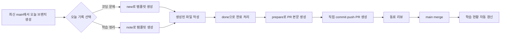

# codingtest_2026

매일 **코딩 문제를 풀거나 학습 내용을 정리**하고, 하루에 PR 하나를 올려 서로 리뷰하는 스터디입니다.

처음 참여한다면 아래 **오늘의 첫 기록**만 순서대로 따라 하면 됩니다.

명령 입력과 문서 정리를 코딩 에이전트에게 맡기고 싶다면 [에이전트로 기록하기](#코딩-에이전트로-기록하기)를 보세요.

[학습 현황](https://github.com/bk123477/codingtest_2026/tree/progress) · [템플릿 상세 설명](docs/templates.md) · [참여 중 문제 해결](CONTRIBUTING.md) · [운영자 안내](docs/setup.md) · [코딩 문제 예시](examples/h-index/) · [학습 정리 예시](examples/learning-note/)

> 현재는 참여자와 실제 기록이 없습니다. 이 구성이 main에 올라간 뒤 GitHub Actions가 성공하면 학습 현황 페이지가 생성됩니다.

## 이 스터디에서 하는 일



하루에 여러 기록을 작성해도 PR은 하나입니다. 코딩 문제와 학습 정리를 같은 PR에 함께 넣어도 됩니다. 각 참여자는 `study/아이디/YYYY-MM-DD` 형식의 자기 브랜치에서 작업합니다.

## 참여자: 오늘의 첫 기록

### 0. 준비하기

Python 3.10 이상과 Git이 필요합니다. 별도 Python 패키지를 설치하지 않습니다. Windows에서는 아래의 `python3`를 `py -3` 또는 `python`으로 바꿔 실행하세요.

```bash
git clone https://github.com/bk123477/codingtest_2026.git
cd codingtest_2026

# 아래 중 내 방식 하나를 골라 처음 한 번만 실행합니다.

# 코딩 문제를 하루 5개 목표로 하는 경우
python3 study.py init 내GitHub아이디 --lang python --goal 5

# 학습 정리만 하루 1건 목표로 하는 경우
python3 study.py init 내GitHub아이디 --goal 1

# 문제와 정리를 섞되, 일일 목표 없이 자유롭게 기록하는 경우
python3 study.py init 내GitHub아이디 --goal none
```

`init`은 참여자마다 처음 한 번 반드시 실행해야 합니다. GitHub 아이디는 이메일 주소나 프로필의 표시 이름이 아니라, GitHub 프로필 URL 마지막 부분의 사용자명입니다. 예를 들어 프로필 주소가 `https://github.com/bk123477`이면 `bk123477`을 입력합니다.

```bash
python3 study.py init bk123477 --lang python --goal 5
```

이 설정은 내 컴퓨터의 `.study/config.json`에만 저장되며 GitHub에는 올라가지 않습니다. `--goal`을 생략하면 기본 목표는 5건입니다. 목표 없이 기록하려면 반드시 `--goal none`을 씁니다. `init`을 완료한 뒤에 `start`로 작업 브랜치를 만들고 첫 문제나 학습 정리를 시작합니다.

### 1. 오늘의 작업 브랜치 만들기

```bash
# init에서 정한 기본 목표로 시작
python3 study.py start

# 오늘만 목표를 3건으로 정해 시작
python3 study.py start --goal 3

# 오늘만 목표 없이 자율 기록으로 시작
python3 study.py start --goal none
```

이 명령은 GitHub의 최신 `origin/main`을 가져온 뒤 `study/내GitHub아이디/오늘날짜` 브랜치를 만듭니다. `--goal`은 **그 날짜에만** 적용됩니다. 생략하면 `init`에서 정한 기본 목표(나중에 `goal`로 바꾼 경우 그 목표)를 사용합니다. 예를 들어 오늘 문제 3개만 풀면 `start --goal 3`, 문제 1개와 학습 정리 1개를 할 계획이면 `start --goal 2`를 실행하세요. 문제와 정리 모두 완료 기록 1개씩으로 합산됩니다. 새 날짜 기록을 시작하기 전에 `git switch main`이나 `git pull`을 따로 실행할 필요는 없습니다. 다만 내 컴퓨터의 `main` 브랜치 자체는 자동으로 갱신되지 않습니다. “미커밋 변경이 있습니다”라는 메시지가 나오면, 전날 작업을 먼저 commit하거나 정리한 뒤 다시 실행하세요.

### 진행 상태를 잊었을 때

```bash
python3 study.py status
```

현재 브랜치, 오늘 목표, 완료·작성 중인 기록, 작업 트리 변경 여부와 다음에 실행할 명령을 보여줍니다. 전날 기록을 확인하려면 `python3 study.py status --date YYYY-MM-DD`를 사용하세요.

### 2-A. 코딩 문제를 푸는 경우

```bash
python3 study.py new https://school.programmers.co.kr/learn/courses/30/lessons/42747 --title "H-Index" --tags "정렬"
```

아래와 같은 폴더가 만들어집니다.

```text
records/YYYY/MM/DD/내GitHub아이디/programmers-42747/
├── README.md      # 문제 요약, 풀이 설명, 확인한 예제
├── solution.py    # 실제 풀이 코드
└── meta.json      # 자동 집계 정보
```

`solution.py`에 코드를 작성하고, `README.md`에서 `TODO:`가 붙은 문제 요약·풀이 방법·확인한 예제 세 항목을 채웁니다. 이미 로컬에서 풀어 둔 코드가 있다면 `--source ./내풀이.py`를 명령 끝에 붙이면 됩니다.

정답을 채점 사이트에서 확인한 뒤 직접 완료 처리합니다.

```bash
# new가 출력한 폴더명으로 완료 처리
python3 study.py done programmers-42747 --minutes 20
```

작성 중인 기록이 하나뿐이면 `python3 study.py done --minutes 20`처럼 대상을 생략할 수 있습니다. 여러 개라면 `programmers-42747` 같은 생성 폴더명이나 `42747` 같은 문제 번호를 지정하세요. 기존 문제 URL도 계속 사용할 수 있습니다.

### 2-B. 코테 대신 공부한 내용을 정리하는 경우

```bash
python3 study.py note --title "Git 브랜치와 merge 정리" --tags "Git"
```

아래 폴더가 만들어집니다. 같은 날 두 번째 정리는 `note-02`가 됩니다.

```text
records/YYYY/MM/DD/내GitHub아이디/note-01/
├── README.md      # 학습 주제/목표, 정리 내용, 배운 점
└── meta.json      # 자동 집계 정보
```

`note-01/README.md`를 열어 `TODO:`가 붙은 학습 주제/목표·정리 내용·배운 점 세 항목을 작성합니다. 강의·책 요약, Git이나 CS 개념 정리, 프로젝트에서 배운 점, 실습 기록을 모두 남길 수 있습니다. 문제 URL과 코드 파일은 필요 없습니다.

기존에 작성한 Markdown 또는 텍스트 글이 있다면 가져올 수 있습니다.

```bash
python3 study.py note --title "오늘의 학습 정리" --source ./내정리.md
```

원본 파일은 건드리지 않고 기록 폴더의 `notes.md`로 복사합니다. 생성된 README에서 학습 목표와 배운 점만 추가로 작성하면 됩니다.

내용을 검토한 뒤 완료 처리합니다. `note-01`은 생성 명령이 출력한 폴더명입니다.

```bash
python3 study.py done note-01 --minutes 30
```

### 3. 하루의 PR 만들기

그날의 모든 기록을 `done`으로 완료 처리한 뒤 실행합니다.

```bash
python3 study.py prepare
```

이 명령은 기록을 검사하고, `.study/PR.md`에 PR 본문을 만들고, 다음에 실행할 `git add`, `git commit`, `git push` 명령을 화면에 보여줍니다. 출력된 Git 명령을 차례로 실행합니다.

GitHub 웹사이트에서 **Compare & pull request**를 누르고 `.study/PR.md` 내용을 PR 본문에 붙여넣습니다. 리뷰 의견이 오면 같은 브랜치에서 파일을 고치고 다시 commit/push합니다. 승인 후 **Squash and merge**를 선택하면 해당 날짜의 기록이 main에 합쳐집니다.

### 4. merge한 브랜치 정리하기

하루마다 새 브랜치를 만들기 때문에, merge한 브랜치를 그대로 두면 목록이 계속 쌓입니다. merge할 때 GitHub의 **Delete branch**를 누르면 원격 브랜치가 정리됩니다. 기록 파일은 main에 이미 합쳐졌으므로 지워지지 않고, PR과 리뷰 내역도 GitHub에 남습니다. 다른 참여자의 로컬 브랜치나 로컬 main은 이 설정으로 바뀌지 않습니다.

내 컴퓨터의 완료 브랜치는 main에 merge된 것을 확인한 뒤 정리합니다.

```bash
git switch main
git pull origin main
git branch -d study/내GitHub아이디/완료날짜
```

`-d`는 merge되지 않았다고 판단한 브랜치를 지우지 않고 멈춥니다. Squash merge를 쓰면 실제 PR은 merge됐어도 Git이 이 메시지를 낼 수 있습니다. GitHub에서 PR이 **Merged**인지 확인한 뒤에만 `git branch -D study/내GitHub아이디/완료날짜`로 로컬 브랜치를 지울 수 있습니다. GitHub의 **Settings → General → Pull Requests → Automatically delete head branches**를 운영자가 켜면 merge 뒤 원격 브랜치를 자동으로 삭제할 수 있습니다.

## 코딩 에이전트로 기록하기

파일을 읽고 수정하며 터미널 명령을 실행할 수 있는 코딩 에이전트에 기록 작업을 맡길 수 있습니다. 참여자는 문제 링크와 풀이 코드 또는 학습 메모를 전달하고, 에이전트는 `new`/`note` 실행과 README 정리, 검증을 담당합니다. 따라서 긴 명령을 매번 직접 입력할 필요가 없습니다.

이 저장소를 에이전트의 작업 폴더로 열고, **루트의 [AGENTS.md](AGENTS.md)를 먼저 읽어 달라**고 요청하세요. Codex, Antigravity 등 사용하는 도구에서 파일을 첨부하거나 경로를 지정해 전달할 수 있습니다. 도구가 이 파일을 자동으로 읽는다고 가정하지 않고, 요청에 명시하는 방식으로 안내합니다.

첫 사용 시에는 아래처럼 설정도 맡길 수 있습니다. `내GitHub사용자명`을 실제 사용자명으로 바꾸세요.

```text
AGENTS.md를 먼저 읽고 스터디 참여 설정을 해줘.
내 GitHub 사용자명은 내GitHub사용자명이고, 기본 언어는 Python이야.
문제와 학습 정리를 섞어서 기록하고 목표는 없이 참여할게.
기존 로컬 설정이 있다면 확인해서 알려줘.
```

이미 푼 문제를 기록할 때는 풀이 코드를 요청문에 직접 붙여 넣는 방식이 가장 간단합니다. 아래 예시의 주소·제목·코드를 본인 것으로 바꿉니다. 채점 확인 문장은 실제 정답을 확인했을 때만 포함하세요.

````text
AGENTS.md를 읽고 오늘 날짜의 문제 기록을 만들어줘.
문제 링크: https://school.programmers.co.kr/learn/courses/30/lessons/42747
제목: H-Index
언어: Python
풀이 코드:
```python
def solution(citations):
    citations.sort(reverse=True)
    for i, citation in enumerate(citations, start=1):
        if citation < i:
            return i - 1
    return len(citations)
```
채점 사이트에서 정답을 확인했어.
이 코드를 기록 폴더의 solution.py에 저장하고 실제 풀이에 맞게 README를 작성한 뒤 검증해줘.
정보가 충분하면 done과 오늘 PR 본문 준비까지 해줘.
commit과 push는 내가 연습할 수 있게 실행할 명령을 알려줘.
````

이미 저장된 코드 파일을 재사용하고 싶을 때만 `내 풀이 파일: ../solutions/h_index.py`와 함께 `--source` 방식을 사용하면 됩니다. 코드가 길거나 여러 문제에서 반복해서 사용할 때 유용합니다.

학습 정리는 공부한 메모를 파일로 제공하거나 대화에 붙여넣으면 됩니다.

```text
AGENTS.md를 읽고 오늘 날짜의 학습 정리를 만들어줘.
제목: Git 브랜치와 merge 정리
내 메모 파일: ../notes/git.md
이 메모를 바탕으로 README를 작성하고 형식을 검증해줘.
완료 처리 전에 내가 내용을 읽어볼 수 있게 파일 위치를 알려줘.
```

초안을 읽은 뒤에는 “내용 확인했어. 완료 처리하고 오늘 PR 본문을 준비해줘”라고 이어서 요청할 수 있습니다. 풀이 파일이나 메모에 없는 채점 결과·학습 경험은 에이전트가 임의로 채우지 않도록 안내해 두었습니다. 문제와 정리 여러 개를 한 번에 전달해도 같은 날짜의 PR 하나로 묶습니다.

Git 명령 실행도 맡기고 싶으면 “검증 후 commit, push하고 PR도 만들어줘”처럼 원하는 범위를 적으세요. 실제 실행은 해당 도구의 터미널 권한과 GitHub 인증이 필요합니다. `AGENTS.md` 자체는 실행 프로그램이 아니며, `study.py`에 AI나 유료 API를 추가한 구성은 아닙니다. 사용하는 코딩 에이전트의 요금·이용 한도는 별도입니다.

## 템플릿은 어떻게 쓰이나요?

`templates/problem.md`와 `templates/note.md`는 공용 원본입니다. 평소에는 이 파일을 수정하지 않습니다.

`new` 또는 `note` 명령이 원본을 읽고 제목·날짜·작성자 같은 정보를 채워 **내 기록 폴더의 README.md**를 새로 만듭니다. 사용자는 생성된 README의 TODO만 자기 내용으로 바꾸면 됩니다.

| 기록 | 명령 | 직접 작성할 내용 | 완료 기준 |
| --- | --- | --- | --- |
| 코딩 문제 | `new 문제URL --title "제목"` | 문제 요약, 풀이 방법, 확인한 예제, 코드 | `done` 또는 `done 문제번호` |
| 학습 정리 | `note --title "주제"` | 학습 주제/목표, 정리 내용, 배운 점 | `done note-01` |

더 자세한 예시와 파일별 역할은 [템플릿 상세 설명](docs/templates.md)에 있습니다. 템플릿 변경은 이후 새로 만드는 기록에만 적용되며, 기존 기록을 덮어쓰지 않습니다.

## 명령어 도움말

모든 명령과 옵션은 아래처럼 확인할 수 있습니다.

```bash
# 전체 명령 목록
python3 study.py --help
# 또는
python3 study.py help

# 특정 명령의 옵션과 예시 확인
python3 study.py note --help
# 또는
python3 study.py help note

# 오늘 어디까지 진행했는지 확인
python3 study.py status
```

## 무엇이 자동이고, 무엇을 직접 하나요?

| 자동 처리 | 참여자가 직접 하는 일 |
| --- | --- |
| 폴더·README·코드 파일·메타데이터 생성 | 풀이 코드 또는 학습 정리 작성 |
| 날짜·작성자·문제 URL/번호 입력 | 문제 정답 또는 정리 내용 확인 |
| 일일 기록 목록과 PR 본문 생성 | `done`, commit, push, PR 생성 |
| 기록 형식과 PR 파일 범위 검사 | 동료 PR 리뷰와 피드백 반영 |
| merge된 기록의 학습 현황 갱신 | PR 승인과 merge |

자동화는 정답을 채점하거나 학습 정리의 사실관계를 판정하지 않습니다. 코딩 문제는 채점 사이트에서 확인하고, 학습 정리는 작성자와 리뷰어가 내용을 검토합니다.

목표의 단위는 완료한 기록 수입니다. 문제 1개 또는 학습 정리 1개를 각각 1건으로 셉니다. 예를 들어 목표가 5건일 때 문제 3개와 정리 2개를 완료하면 5/5입니다. 따라서 코딩과 정리를 섞는 경우에도 별도 설정은 필요 없습니다. `start --goal none`으로 그날을 시작한 자율 참여자는 달성·미달 판단 없이 완료 건수만 현황에 표시됩니다.

평소 기본 목표를 앞으로의 날짜부터 바꾸고 싶을 때만 `goal` 명령을 사용합니다. `start --goal`은 오늘만 바꾸고, `goal --from`은 해당 날짜 이후의 기본 목표를 바꿉니다.

이미 오늘 작업을 시작한 뒤 목표를 수정하려면 `goal --date`를 사용합니다. 이 명령은 선택한 하루에만 적용됩니다.

```bash
python3 study.py goal 10 --date 2026-09-07
```

첫 기록을 만든 뒤 목표를 바꿀 때는 `init`을 다시 실행하지 않고 아래처럼 사용합니다. 적용일 이후 기록에만 새 목표가 반영됩니다.

```bash
python3 study.py goal 3 --from 2026-09-10
python3 study.py goal none --from 2026-09-10
```

## GitHub 용어를 짧게 보면

| 용어 | 이 스터디에서의 의미 |
| --- | --- |
| `main` | 리뷰를 마친 기록이 모이는 기준 브랜치 |
| 브랜치 | 내 작업을 다른 사람 작업과 분리해 두는 공간 |
| commit | 현재 파일 변경을 Git에 저장하는 단위 |
| push | 내 컴퓨터의 commit을 GitHub에 올리는 작업 |
| PR | 내 브랜치의 변경을 main에 합쳐 달라고 요청하는 페이지 |
| review | PR에서 코드나 문서에 의견을 남기고 승인하는 과정 |
| merge | 승인된 PR의 변경을 main에 반영하는 작업 |

작업 중 막히는 상황, 전날 PR이 남아 있을 때의 처리, fork 참여 방법은 [참여 중 문제 해결](CONTRIBUTING.md)을 보세요. 팀원 초대, Actions 확인, main 보호 규칙 설정은 [운영자 안내](docs/setup.md)에 있습니다.
