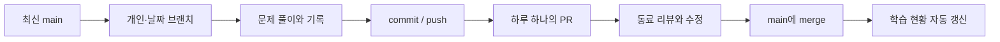

# codingtest_2026

매일 문제를 풀고, 하루 하나의 PR로 서로의 풀이를 리뷰하는 스터디입니다.

[학습 현황](https://github.com/bk123477/codingtest_2026/tree/progress) · [날짜별 기록](records/) · [참여 방법](CONTRIBUTING.md) · [완성 예시](examples/h-index/) · [설계 이유](docs/design.md) · [운영자 설정](docs/setup.md)

> 학습 현황은 이 구성이 `main`에 올라간 뒤 **Study progress** Actions가 처음 성공하면 열립니다.
> 현재 참여자는 미등록이며, 기본 목표는 하루 5문제입니다. 각자 변경할 수 있습니다.

## 이렇게 공부합니다



브랜치는 `study/아이디/YYYY-MM-DD`, 폴더는 `records/YYYY/MM/DD/아이디/플랫폼-문제번호/`를 사용합니다.
4명이 하루 5문제를 풀면 **20개의 문제 폴더와 4개의 일일 PR**이 생깁니다.
전날 PR이 리뷰 중이어도 다음 날은 최신 `main`에서 새 브랜치를 만들 수 있습니다.

## 처음 한 번

Python **3.10 이상**과 Git이 필요합니다. 외부 Python 패키지 설치는 없습니다.
Windows에서는 아래 `python3`를 `py -3` 또는 `python`으로 바꾸면 됩니다.

```bash
git clone https://github.com/bk123477/codingtest_2026.git
cd codingtest_2026
python3 study.py init 내GitHub아이디 --lang python --goal 5
```

아이디는 실제 GitHub 아이디로 바꿔주세요. 소문자로 저장합니다.
설정은 커밋되지 않는 `.study/config.json`에 저장됩니다.
첫 문제를 만들면 `members/아이디.json`도 자동 생성되므로 첫 풀이와 함께 커밋하면 됩니다.
팀원 초대와 리뷰 필수 설정은 운영자가 [설정 안내](docs/setup.md)를 따라 한 번 진행합니다.

## 매일 사용하는 명령

**1. 오늘 브랜치를 만듭니다.**

```bash
python3 study.py start
```

최신 `origin/main`에서 `study/아이디/한국날짜`를 생성합니다. 커밋하지 않은 작업이 있으면 중단합니다.
이미 만든 오늘 브랜치로 돌아가려면 `git switch study/아이디/YYYY-MM-DD`를 사용하세요.

**2. URL과 제목으로 문제 기록을 만듭니다.**

```bash
python3 study.py new https://school.programmers.co.kr/learn/courses/30/lessons/42747 --title "H-Index" --tags "정렬"
```

이미 로컬에서 풀었다면 `--source ./내풀이.py`를 덧붙여 그대로 가져올 수 있습니다.
URL에서 플랫폼과 문제 번호를 추출하고, 날짜·작성자·언어·태그를 자동 기록합니다.
문제 제목은 직접 입력합니다. 사이트 로그인이나 크롤링에 의존하지 않습니다.

생성된 `solution.py`에 코드를 작성하고 `README.md`의 **문제 요약·풀이 방법·확인한 예제** 세 항목을 짧게 채웁니다.
원문 전체를 복사하거나 Markdown 안에 코드를 또 붙여넣을 필요는 없습니다.

**3. 채점 사이트에서 정답을 확인하고 완료 처리합니다.**

```bash
python3 study.py done https://school.programmers.co.kr/learn/courses/30/lessons/42747 --minutes 20
```

필수 설명과 코드가 비어 있으면 완료 처리되지 않습니다. 일일 README가 자동 갱신됩니다.
이 과정을 그날 푸는 문제마다 반복합니다. `--minutes`는 생략해도 됩니다.

**4. 하루의 PR을 준비합니다.**

```bash
python3 study.py prepare
```

문제 목록·목표 달성 현황·추천 리뷰어를 담은 `.study/PR.md`와 실행할 Git 명령이 출력됩니다.
출력된 `git add`, `git commit`, `git push`를 직접 실행하세요.
GitHub에서 **Compare & pull request**를 누르고 `.study/PR.md` 내용을 붙여넣으면 됩니다.
GitHub CLI를 사용한다면 출력된 `gh pr create ... --body-file .study/PR.md`로 생성할 수도 있습니다.

**5. 리뷰를 받고 같은 브랜치에 수정 커밋을 push합니다.**

리뷰어는 PR의 **Files changed**에서 코드 줄에 의견을 남기고 **Submit review**로 리뷰를 제출합니다.
승인 후 **Squash and merge**하고 작업 브랜치를 삭제합니다. 다음 날에는 다시 `start`를 실행합니다.

## 기록 구조

```text
records/
└── 2026/09/05/
    ├── alice/
    │   ├── README.md                    # 오늘 완료/목표와 문제 목록 (자동 생성)
    │   ├── programmers-42747/
    │   │   ├── README.md                # 문제 요약, 풀이, 확인한 예제, 회고
    │   │   ├── solution.py              # 실행하고 줄 단위로 리뷰할 코드
    │   │   └── meta.json                # 자동 집계용 정보
    │   └── baekjoon-1000/...
    └── bob/...
members/아이디.json                        # 참여 시작일과 목표 이력
.study/                                  # 개인 설정·PR 본문·로컬 보고서 (Git 제외)
templates/problem.md                     # 공용 기록 템플릿
```

위 아이디와 폴더는 구조를 설명하기 위한 예시입니다. 실제 공부 실적으로 등록하지 않았습니다.
같은 문제를 다른 사람이 풀어도 충돌하지 않습니다. 같은 사람이 같은 날 같은 문제를 다시 생성하면 덮어쓰지 않습니다.
다른 날짜의 재풀이는 새로운 학습 기록으로 집계합니다.

## 자동으로 처리되는 것

| 작업 | 처리 방법 |
| --- | --- |
| 문제 폴더·코드 파일·기록 양식 | `new` |
| 기존 코드 가져오기 | `new --source 파일` |
| 완료 상태·일일 문제 목록 | `done` |
| 개인 목표 변경과 적용일 이력 | `goal 3 --from 2026-09-10` |
| 일일 PR 본문·추천 리뷰어 | `prepare` |
| 잘못된 기록·미완성 제출·다른 사람/날짜 파일 혼입 검사 | push / PR 시 Actions |
| 사람별 오늘 실적·최근 14일 달성표·같은 문제의 여러 풀이 | `main` push 후 `progress` 브랜치 갱신 |
| 새 날짜의 미제출 현황 반영 | 매일 한국 시간 00:15 예약 갱신 |

목표를 못 채운 날도 PR을 제출할 수 있습니다. 집계에는 미달로 표시합니다.
CI는 기록 형식과 제출 범위를 검사하며 **정답 여부를 채점하지 않습니다**.
채점 사이트에서 확인한 뒤 `done` 처리하는 방식입니다.
`progress`에는 merge된 풀이만 표시됩니다. 아직 리뷰 중인 공부는 PR에서 확인합니다.

## 추가 사용법

```bash
# 다른 언어 / 난이도
python3 study.py new https://www.acmicpc.net/problem/1000 --title "A+B" --lang cpp --level "Bronze V"

# 지난 날짜 기록: start, new, done, prepare에 같은 --date를 붙입니다.
python3 study.py start --date 2026-09-05

# 다음 날짜부터 하루 3문제로 변경 (현재 작업 브랜치에서 커밋)
python3 study.py goal 3 --from 2026-09-10

# 수동 메타데이터 수정 후 일일 목록 갱신
python3 study.py index --date 2026-09-05

# 로컬 검증 / 현황 생성
python3 study.py check
python3 study.py report

# 자동화 도구 테스트
python3 -m unittest discover -s tests -v
```

지원 플랫폼: 프로그래머스, 백준, LeetCode.
지원 언어: Python, JavaScript, TypeScript, Java, C++, C, Kotlin, Go, Swift, Rust.
언어 옵션은 `python`, `javascript`, `typescript`, `java`, `cpp`, `c`, `kotlin`, `go`, `swift`, `rust`입니다.
채점 사이트의 실행 규칙에 맞는 함수/클래스/입출력 코드는 직접 작성합니다.

템플릿만 개인 레포에서 쓰거나, fork로 참여하는 방법은 [참여 안내](CONTRIBUTING.md#개인-레포에서도-사용하기)에 정리했습니다.
