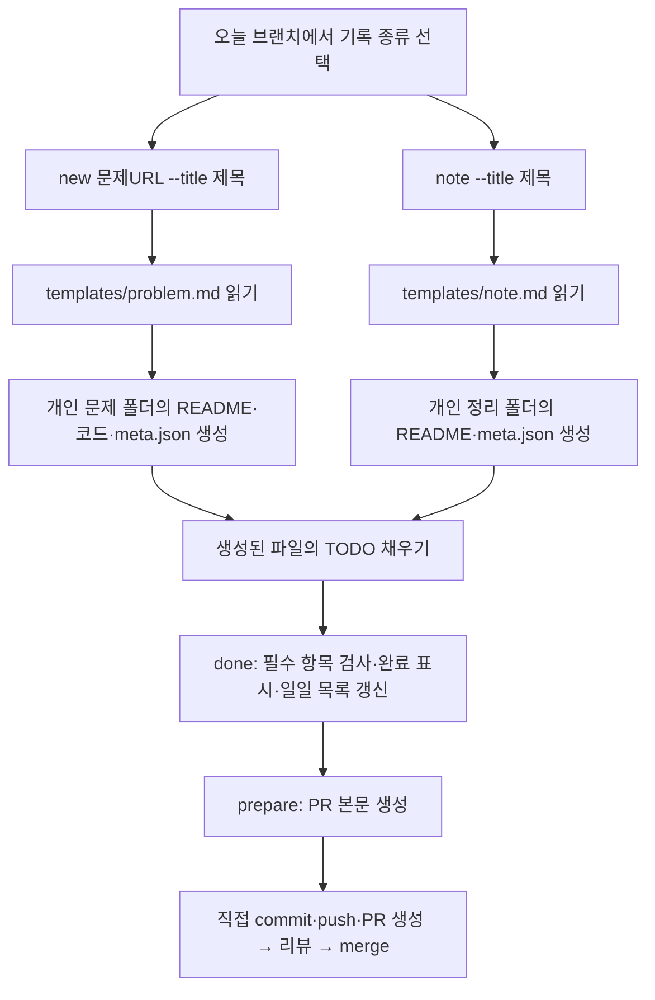

# 템플릿은 어떻게 적용되나요?

사용자는 공용 템플릿 원본을 직접 수정하지 않습니다.
`new` 또는 `note`를 실행하면 도구가 원본 양식을 읽고 제목·날짜·작성자를 채워
본인의 날짜별 기록 폴더에 새 파일을 만듭니다. 터미널에 출력된 경로의 `README.md`를 IDE에서 열어 작성합니다.
명령이 편집기를 자동으로 열거나 대화형 입력창을 띄우는 방식은 아닙니다.

코딩 에이전트에게 이 과정을 맡길 수도 있습니다. 저장소 루트의 [AGENTS.md](../AGENTS.md)를 먼저 읽게 한 뒤, 문제 링크·풀이 파일 또는 학습 메모를 제공하세요. 에이전트가 같은 CLI를 실행하고 생성된 README를 정리합니다. 복사해서 사용할 요청 예시는 [README의 에이전트 안내](../README.md#코딩-에이전트로-기록하기)에 있습니다.

매일 `start`는 원격 `origin/main`을 가져와 새 날짜 브랜치의 기준으로 사용합니다. 새 기록을 만들기 위해 로컬 main을 먼저 pull할 필요는 없습니다. 이미 열려 있는 날짜 브랜치는 자동으로 최신 main을 받지 않으므로, 충돌 해결이나 최신 변경 반영이 필요할 때만 `git fetch origin` 후 `git merge origin/main` 또는 GitHub의 **Update branch**를 사용합니다.



## 자동 입력과 직접 작성의 차이

| 구분 | 코딩 문제 | 학습 정리 |
| --- | --- | --- |
| 생성 명령 | `new 문제URL --title "제목"` | `note --title "주제"` |
| 적용하는 원본 | [problem.md](../templates/problem.md) | [note.md](../templates/note.md) |
| 폴더 이름 | `programmers-42747`, `codetree-문제slug` 등 | `note-01`, `note-02` 등 |
| 자동 입력 | 제목·날짜·아이디·언어·URL·문제 번호 | 제목·날짜·아이디·정리 식별자 |
| 직접 작성 | 문제 요약·풀이 방법·확인한 예제·코드 | 학습 주제/목표·정리 내용·배운 점/확인한 내용 |
| 선택 정보 | 난이도·태그·시간·복잡도·회고 | 참고 자료·태그·시간·회고 |
| 최초 상태 | `draft` | `draft` |
| done 이후 상태 | `solved` | `completed` |
| 목표 집계 | 완료한 문제 1개 = 1건 | 완료한 정리 1개 = 1건 |

문제 URL은 프로그래머스, 백준, LeetCode, CodeTree를 지원합니다. CodeTree는
`https://www.codetree.ai/ko/frequent-problems/.../problems/<slug>/description`
또는 `https://www.codetree.ai/training-field/frequent-problems/problems/<slug>` 형식을
사용하며, 생성 폴더는 `codetree-<slug>`가 됩니다.

제목 등 명령에 입력한 값은 도구가 해당 파일에 옮겨 적습니다.
분류·태그는 동의어와 띄어쓰기를 정규화합니다. 핵심 분류 밖의 표현은 검색어로
보존하며, 자세한 기준은 [Wiki 분류 안내](wiki.md#핵심-분류와-세부-검색어)를 참고하세요.
`study.py` 자체는 본문을 AI로 작성하거나 웹에서 문제·참고 자료 내용을 다운로드하지 않습니다. 별도로 사용하는 코딩 에이전트는 제공된 코드·메모를 바탕으로 README 작성을 도울 수 있습니다.

## 코딩 문제 예시

```bash
python3 study.py init alice --lang python --goal 5
# 오늘만 목표 3건으로 시작 (생략하면 init의 기본 목표)
python3 study.py start --goal 3
python3 study.py new https://school.programmers.co.kr/learn/courses/30/lessons/42747 --title "H-Index"
```

날짜가 2026-09-05라면 `records/2026/09/05/alice/programmers-42747/`이 생깁니다.
그 안의 README에는 실제 제목, URL, 날짜, 작성자, 코드 링크가 이미 들어 있습니다.
`TODO:`가 붙은 세 부분과 `solution.py`의 코드를 채운 뒤 정답을 확인합니다. 난이도·풀이 방식·자료구조·알고리즘은 `new` 또는 `done` 옵션으로 README와 `meta.json`에 함께 기록할 수 있습니다.

```bash
python3 study.py done programmers-42747 --minutes 20
python3 study.py prepare
```

작성 중인 기록이 하나뿐이면 `done` 뒤의 대상을 생략할 수 있습니다. 여러 기록이 있으면 생성된 폴더명 또는 문제 번호를 지정하며, 문제 URL 방식도 계속 사용할 수 있습니다.

같은 날짜의 작성 중 기록을 모두 완료 처리하려면, 모든 문제의 채점 결과를 확인한 뒤 `python3 study.py done --all`을 사용합니다. 모든 기록의 필수 항목을 먼저 검사하므로 하나라도 실패하면 어떤 기록도 완료 처리하지 않습니다. `--all`에는 시간이나 난이도 등 개별 기록 옵션을 함께 지정할 수 없습니다.

풀이 방식은 `self`(스스로 해결), `hint`(힌트 참고), `answer`(답안·해설 참고) 중 하나를 사용합니다. 자료구조와 알고리즘은 쉼표로 구분합니다.

완성된 모양은 [H-Index 예시](../examples/h-index/README.md)에서 볼 수 있습니다.

## 학습 정리 예시

아래는 코딩 문제를 풀지 않고 매일 정리 한 건을 남기는 신규 참여자 예시입니다.
실제 명령에서는 `bob`을 본인의 GitHub 아이디로 바꿉니다.

```bash
# 첫 사용 시 한 번
python3 study.py init bob --goal 1

# 매일
python3 study.py start
python3 study.py note --title "Git 브랜치와 merge 정리" --tags "Git"
```

날짜가 2026-09-05라면 다음 파일들이 생깁니다.

```text
records/2026/09/05/bob/
├── README.md           # 자동 생성한 일일 기록 목록
└── note-01/
    ├── README.md       # 사용자가 작성할 학습 정리 양식
    └── meta.json       # 자동 집계 정보
```

`note-01/README.md`는 처음에 다음과 같은 내용을 갖습니다. 참고 자료·회고 항목도 함께 생성됩니다.

```markdown
# Git 브랜치와 merge 정리

- 기록 유형: 학습 정리
- 날짜: 2026-09-05 · 작성자: bob

## 학습 주제 / 목표

TODO: 오늘의 학습 주제와 목표를 작성하세요.

## 정리 내용

TODO: 오늘 정리한 내용을 작성하세요.

## 배운 점 / 확인한 내용

TODO: 배운 점이나 직접 확인한 내용을 작성하세요.
```

이 세 TODO 문장을 자신의 내용으로 바꿉니다. 항목 제목은 그대로 두고, 각 항목 안에서는
설명·표·코드 블록·이미지·하위 제목을 자유롭게 사용할 수 있습니다.
단순 개념 공부, 강의나 책 요약, 프로젝트에서 배운 내용, 실습 결과도 같은 양식으로 기록합니다.

```bash
python3 study.py done note-01 --minutes 30
python3 study.py prepare
```

`done`에는 생성 시 출력된 **폴더명**을 사용합니다. 같은 날 두 번째 정리는 `note-02`입니다.
`note --slug git-branch --title "Git 브랜치 정리"`로 이름을 정했다면 `done note-git-branch`로 완료합니다.
완성된 모양은 [학습 정리 예시](../examples/learning-note/README.md)에서 볼 수 있습니다.

## 이미 작성한 글을 가져오는 경우

```bash
python3 study.py note --title "오늘의 학습 정리" --source ./내정리.md
```

기존 UTF-8 Markdown/텍스트 파일을 `note-01/notes.md`로 그대로 복사합니다.
원본 파일은 그대로 남습니다. 생성된 README의 **정리 내용**은 아래처럼 연결됩니다.

```markdown
## 정리 내용

가져온 정리: [notes.md](notes.md)
```

이때는 README의 **학습 주제/목표**와 **배운 점/확인한 내용** 두 항목만 추가로 채우면 됩니다.
도구는 가져온 글이 비어 있지 않은지도 검사합니다. 이미지나 첨부 파일은 자동 복사하지 않으므로
기록 폴더에 함께 넣고 Markdown의 상대 경로가 맞는지 확인하세요.
문서형 파일(PDF, Word 등)을 변환하는 기능은 없습니다.

참고 URL은 `note` 실행 시 `--reference https://example.com/article`처럼 추가합니다.
여러 URL은 `--reference`를 여러 번 지정하면 됩니다. URL 없이 책 이름 등을 참고 자료란에 직접 적어도 됩니다.

## 완료와 업로드는 별도 단계입니다

파일을 저장하면 작성 내용만 저장됩니다. `done`이 완료 상태와 일일 목록을 갱신합니다.
`prepare`는 `.study/PR.md`와 실행할 Git 명령을 만듭니다. 사용자가 출력된 명령으로
commit·push한 뒤 PR을 생성해야 GitHub에 올라갑니다. PR은 하루에 하나이며 두 유형을 함께 포함할 수 있습니다.

| 파일 | 사용자가 편집하나요? |
| --- | --- |
| `templates/problem.md`, `templates/note.md` | 공용 원본입니다. 양식 자체를 바꿀 때만 수정합니다. |
| 각 기록 폴더의 `README.md` | 네. 자기 내용으로 TODO를 채웁니다. |
| 문제의 `solution.*`, 가져온 정리의 `notes.md` | 네. 풀이 코드나 가져온 글을 수정합니다. |
| 개인 날짜 폴더의 `README.md` | 자동 생성 목록입니다. `new`, `note`, `done`, `prepare`, `index`가 갱신합니다. |
| `meta.json` | 대부분 자동 관리합니다. 상태는 `done`으로 바꿉니다. |
| `.study/PR.md` | 리뷰 요청을 추가해 PR 본문으로 사용합니다. `prepare` 재실행 시 다시 생성됩니다. |

목표 2건에 문제 1개·정리 1개를 완료하면 2/2 달성입니다. 각각의 학습량이 같다는 뜻은 아니며
완료한 기록의 개수를 세는 규칙입니다. 현황에 유형별 누적도 별도로 표시됩니다.
학습 정리만 하는 참여자는 문제 채점 확인란 없이 학습 정리용 확인란이 포함된 PR 본문을 받습니다.

문제와 정리를 섞는 경우에도 목표는 합계로 계산합니다. 예를 들어 `init alice --goal 5` 뒤 문제 3개와 정리 2개를 완료하면 5/5입니다. 그날만 목표를 바꾸려면 브랜치를 만들 때 `start --goal 3`처럼 입력하세요. 문제 1개와 정리 1개를 할 날은 `start --goal 2`입니다. `start --goal none`은 그날만 자율 기록으로 처리하며, 다음 날에는 기본 목표로 돌아갑니다. 앞으로의 기본 목표 자체를 바꾸려면 `goal none --from YYYY-MM-DD`를 사용합니다. 자율 기록도 PR·리뷰 절차는 같고 현황에는 완료 건수만 표시됩니다.

작업 중 목표를 바꾸려면 `python3 study.py goal 10 --date YYYY-MM-DD`를 사용합니다. `--date`는 해당 날짜에만 적용되고, `--from`은 해당 날짜 이후의 기본 목표를 바꿉니다.

템플릿 변경은 이후 생성하는 기록에 적용됩니다. 기존 README를 덮어쓰지 않습니다.
공용 템플릿의 필수 항목 제목을 바꾸려면 `study.py`의 해당 유형 검증 규칙도 함께 수정해야 합니다.
자정을 넘기거나 지난 날짜에 기록할 때는 `start`, `new`/`note`, `done`, `prepare`에 같은 `--date YYYY-MM-DD`를 지정하세요.
